# ndraw

---

<div >
    
    
    
    <h4>ndraw是一个可自由定义网络图、流程图以及简单的神经网络可视化（目前支持Tensorflow2.0+模型可视化）工具</h4>
    <p>
    
    </p>
</div>


## 安装 

### 1、pip安装
```
pip install ndraw -U
```

### 2、源码安装

下载源码，打开命令行

```
python setup.py bdist_egg

python setup.py install
```


## 自定义画图

### 1、简单直线流程
```python
# -*- encoding: utf-8 -*-
import ndraw
graph = ndraw.AutoGraph()
graphs = graph.create("开始").to("过程1").to("过程2").to("过程3").to("过程4").to("结束")
ndraw.server(graphs,theme=ndraw.BLUE_WHITE)

# v1.1.4开始，可以不使用ndraw.server(),AutoGraph自带了server()和render()
# graph.create("开始").to("过程1").to("过程2").to("过程3").to("过程4").to("结束").server()

```


### 2、添加元素信息

> Node

```python
# -*- encoding: utf-8 -*-
import ndraw
from ndraw import Node

graph = ndraw.AutoGraph()
graphs = graph.create("开始")\
    .to(Node("过程1",["1.xxx","2.xxx"]))\
    .to(Node("过程2",["1.xxx","2.xxx"]))\
    .to("结束")
ndraw.server(graphs,theme=ndraw.DEFAULT,flow=ndraw.HORIZONTAL)
```

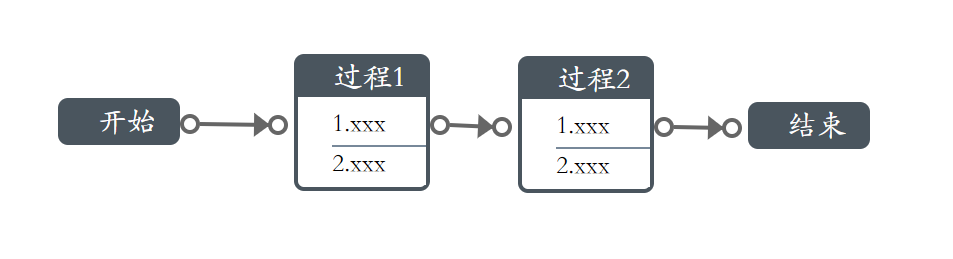

### 3、定义单节点样式

> theme

```python
# -*- encoding: utf-8 -*-
import ndraw
from ndraw import Node

graph = ndraw.AutoGraph()
graphs = graph.create(Node("开始",theme=ndraw.GREEN_WHITE))\
    .to(Node("过程1",data=["1.xxx","2.xxx"],theme=ndraw.DEEPGRAY_WHITE))\
    .to(Node("过程2",data=["1.xxx","2.xxx"],theme=ndraw.BLUE_WHITE))\
    .to(Node("结束",theme=ndraw.GREEN_WHITE))
ndraw.server(graphs)
```

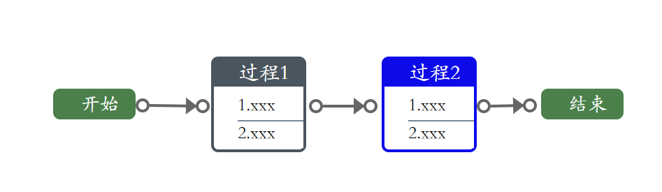

### 4、分流

> tos()

```python
# -*- encoding: utf-8 -*-
import ndraw
from ndraw import Node

graph = ndraw.AutoGraph()
graphs = graph.create(Node("开始", theme=ndraw.GREEN_WHITE)) \
    .tos([
             Node("分流1", data=["1.xxx", "2.xxx"], theme=ndraw.DEEPGRAY_WHITE),
             Node("分流2", data=["1.xxx", "2.xxx"], theme=ndraw.DEEPGRAY_WHITE),
        ]) \
    .to(Node("汇总", theme=ndraw.GREEN_WHITE))\
            .tos([
                Node("分流1", data=["1.xxx", "2.xxx"], theme=ndraw.DEEPGRAY_WHITE),
                Node("分流2", data=["1.xxx", "2.xxx"], theme=ndraw.DEEPGRAY_WHITE),
            ]) \
    .to(Node("结束", theme=ndraw.GREEN_WHITE))
ndraw.server(graphs)
```

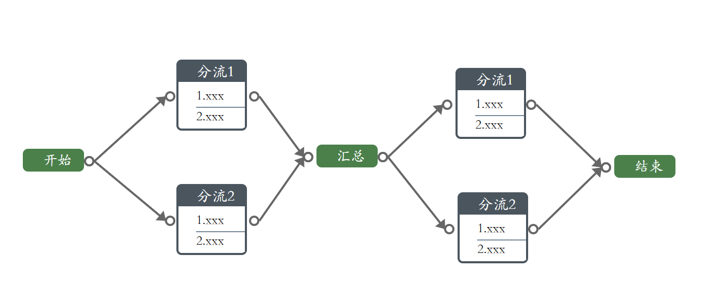

### 5、汇总

> creates()

```python
# -*- encoding: utf-8 -*-
import ndraw
from ndraw import Node

graph = ndraw.AutoGraph()
graphs = graph.creates([
             Node("分流1", data=["1.xxx", "2.xxx"], theme=ndraw.DEEPGRAY_WHITE),
             Node("分流2", data=["1.xxx", "2.xxx"], theme=ndraw.DEEPGRAY_WHITE),
        ]) \
             .to(Node("结束", theme=ndraw.GREEN_WHITE))
ndraw.server(graphs)
```

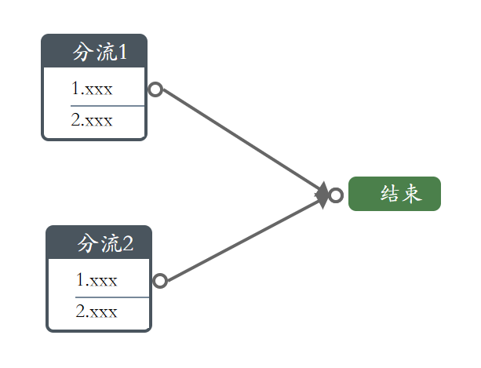

### 6、自定义图形位置

```python
# -*- encoding: utf-8 -*-
import ndraw
g = ndraw.StableGraph()

node1 = g.add_node(ndraw.Node(name='节点1',x=10,y=10))
node2 = g.add_node(ndraw.Node(name='节点2',data =['111111111','22222222'],x=200,y=10))
node3 = g.add_node(ndraw.Node(name='节点3',data =['111111111','22222222'],x=10,y=200))
g.add_link((node1,node2))
g.add_link((node1,node3))
ndraw.server(g,theme=ndraw.DEFAULT)
# v1.1.4开始，可以不使用ndraw.server(),StableGraph()和render()
# g.server()
```

### 7、自定义主题

```python
# -*- encoding: utf-8 -*-
import ndraw
from ndraw import Node


class Theme1(ndraw.Theme):
    '''
    自定义主题  继承ndraw.Theme即可
    '''
    # 边框颜色
    border_color = 'red'
    # 数据区域颜色
    data_color = 'white'
    # 标题区域颜色
    title_color = '#181b16'
    # 标题字体大小
    title_font_size = '17px'
    # 标题字体颜色
    title_font_color = 'white'
    #其他属性参考    ndraw.Theme 

graph = ndraw.StableGraph()
node1 = graph.add_node(Node("开始",x=10,y=10,theme=Theme1()))
ndraw.server(graph)
```

## TF模型可视化

> 可以参考testTFmodel.py

### 1、pb模型可视化
```
--pbpath
  |--variables
  |--saved_model.pb

```

```python
import ndraw
ndraw.server("pbpath")
# 打开浏览器访问9999端口即可
```
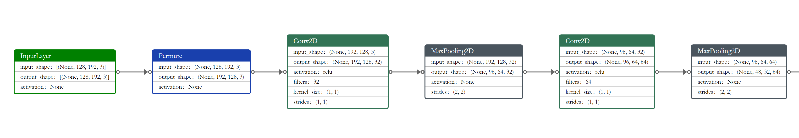

### 2、h5模型可视化

```python
import ndraw
ndraw.server("model.h5")
# 打开浏览器访问9999端口即可
```

### 3、模型对象可视化

```python
import ndraw
import tensorflow as tf
model = tf.keras.Sequential([
    tf.keras.layers.Dense(512, activation='relu'),
    tf.keras.layers.Dense(256, activation='relu'),
    tf.keras.layers.Dense(2, activation='softmax')
])
model.build(input_shape=(None, 100))
ndraw.server(model)
# 打开浏览器访问9999端口即可
```

### 4、生成html文件

```python
import ndraw
html = ndraw.render("pb/h5/mode均可",out_file="model.html")
# 生成一个model.html文件
```

### 5、可视化主题

可视化主题仅仅对于部分节点生效，类似于LSTM，Conv2D已有预置主题

1、DEFAULT

```python
import ndraw
ndraw.server("model.h5",theme=ndraw.DEFAULT)
```
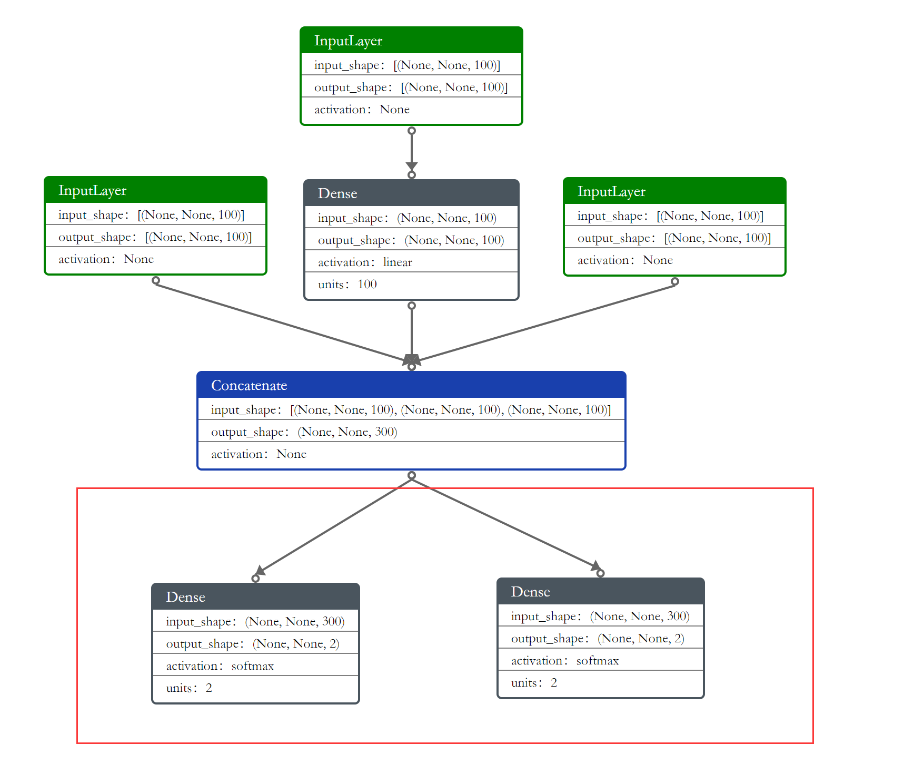

2、BLACK_WHITE

```python
import ndraw
ndraw.server("model.h5",theme=ndraw.BLACK_WHITE)
```
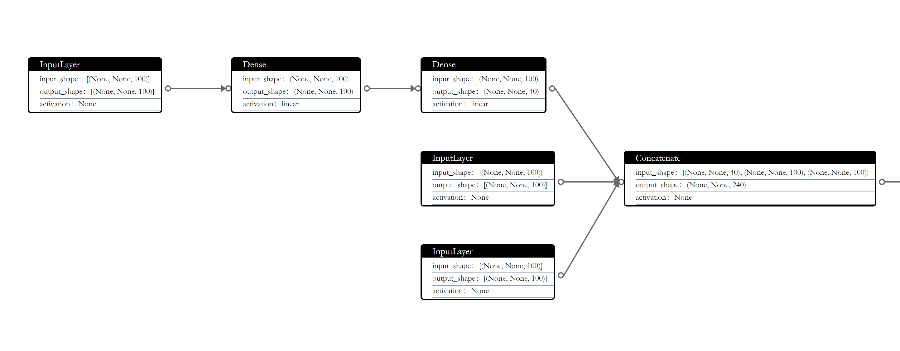

3、LIGHTBLACK_WHITE

```python
import ndraw
ndraw.server("model.h5",theme=ndraw.LIGHTBLACK_WHITE)
```
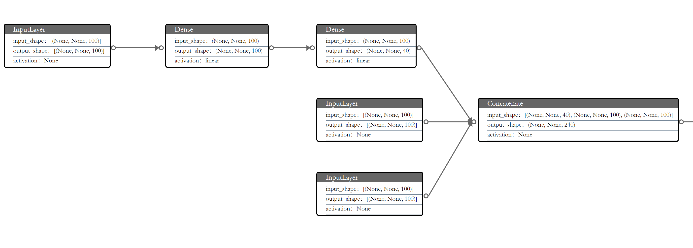

4、GREEN_WHITE

```python
import ndraw
ndraw.server("model.h5",theme=ndraw.GREEN_WHITE)
```
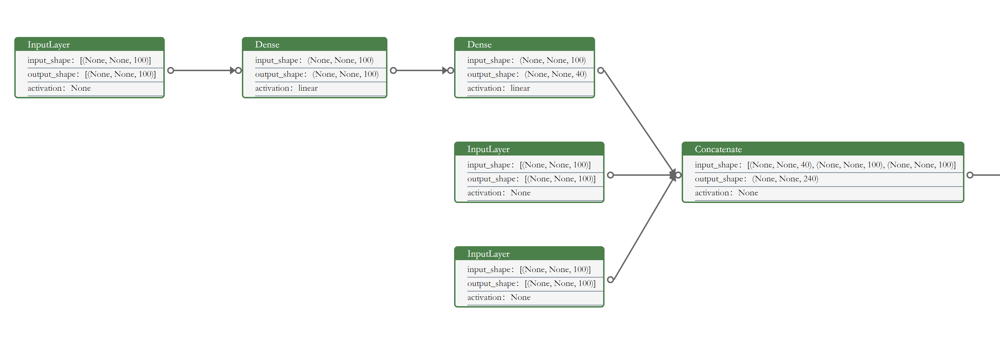

6、PURPLE_WHITE

```python
import ndraw
ndraw.server("model.h5",theme=ndraw.PURPLE_WHITE)
```
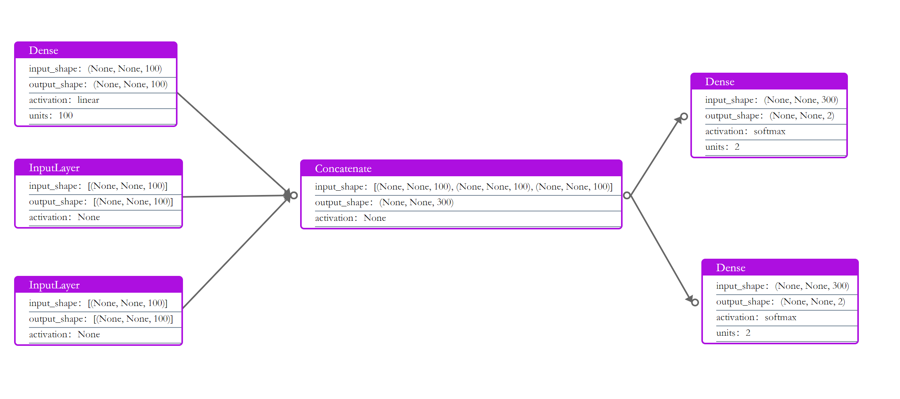

### 6、其他参数

```
:param host: 服务地址 可自定义
:param port: 服务端口可自定义
:param flow: 布局方式：vertical and horizontal
```


## 参考图

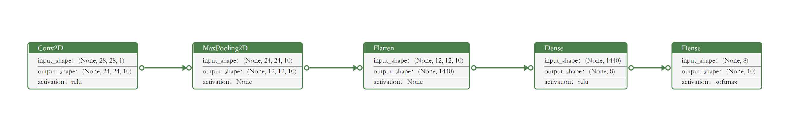

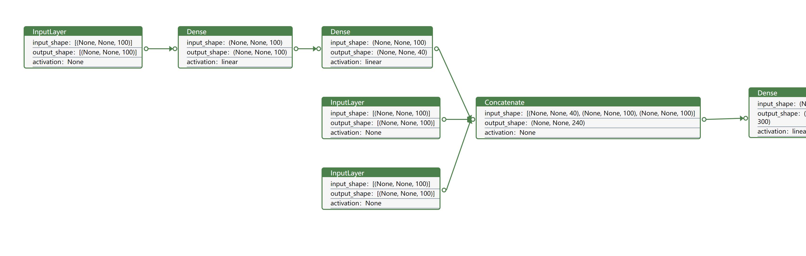